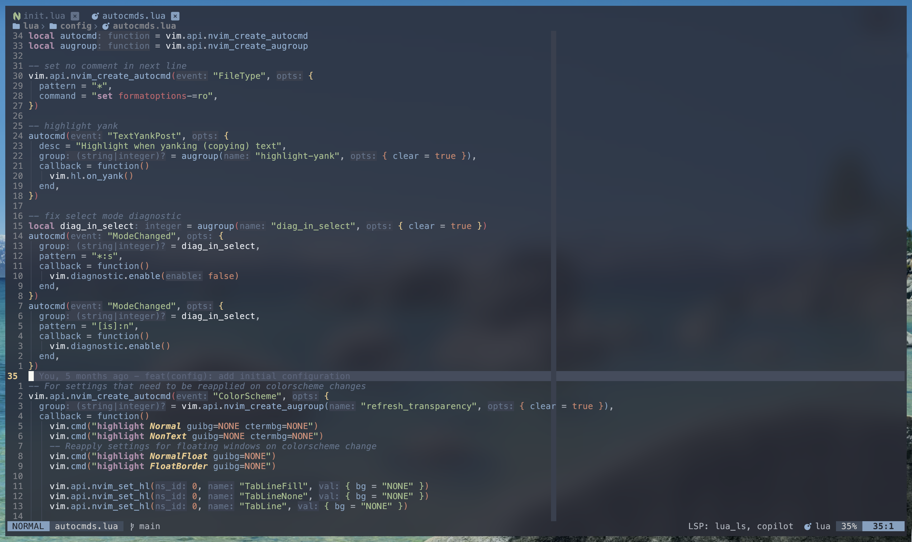

# ⚡ Neovim Configuration

**Neovim 0.11+** · **lazy.nvim** · **94 pinned plugins** · **MIT**

A personal Neovim setup built for speed, a transparent aesthetic, and a **custom non-QWERTY movement layout**. Everything is lazy-loaded, LSP-first, and organized so each plugin lives in exactly one file.



## ✨ Highlights

- **🚀 Lazy by default** — `lazy.nvim` with `defaults = { lazy = true }`, a trimmed runtimepath, and ~30 built-in plugins disabled.
- **🧠 Modern LSP** — uses the Neovim 0.11+ `vim.lsp.config` / `vim.lsp.enable` API. No `lspconfig.setup()` calls.
- **🎨 Transparent UI** — `nordfox` with transparency, a floating-window border applied everywhere, and terminal background sync on enter/leave.
- **⌨️ Remapped movement** — `u` `e` `n` `i` replace `k` `j` `h` `l`. See the warning below before you touch anything.
- **🔍 Telescope-driven** — files, grep, buffers, undo tree, keymaps, and LSP navigation all go through Telescope, with `flash` labels inside the picker.
- **🛠️ Full toolchain** — Mason-managed servers, `conform.nvim` formatting, `nvim-dap` debugging, `overseer` tasks, and Git via `neogit` / `diffview` / `lazygit`.

## ⚠️ Read this first — the keyboard layout

This config **rebinds the core Vim motions**. Muscle memory from a stock Neovim will not transfer.

```
                u  →  up                U  →  up 5 lines
   n  ←  left       right  →  i         N  →  start of line   ($ is I)
                e  →  down              E  →  down 5 lines
```

The keys those motions displaced were moved rather than deleted:

| Original key | Now does | Original action moved to |
| :--- | :--- | :--- |
| `i` | move right | `k` (insert before cursor) |
| `I` | move to line end | `K` (insert at line start) |
| `u` | move up | `l` (undo) |
| `e` | move down | `h` (jump to end of word) |
| `n` / `N` | move left / line start | `=` / `-` (next / prev search, centered) |
| `s` | — | Flash jump (`s` also = Flash in Telescope) |
| `` ` `` | — | toggle vertical terminal |

If you want stock motions back, `lua/config/keymaps.lua` is a single declarative table — delete the `-- Movement` and `-- Actions` blocks.

## 📋 Requirements

**Required**

| Tool | Why |
| :--- | :--- |
| Neovim **0.11+** (developed on 0.12) | `vim.lsp.config`, `vim.hl.on_yank`, treesitter `main` branch. `vim.lsp.document_color` needs 0.12 |
| `git`, `curl`, a C compiler + `make` | lazy.nvim bootstrap, `telescope-fzf-native`, LuaSnip `jsregexp` |
| A [Nerd Font](https://www.nerdfonts.com/) | icons in the statusline, tabline, completion menu, and file explorer |
| [`ripgrep`](https://github.com/BurntSushi/ripgrep) | live grep |
| [`fd`](https://github.com/sharkdp/fd) | file finder |
| Node.js + npm | many Mason-installed language servers |

**Optional** (features degrade gracefully if missing)

| Tool | Unlocks |
| :--- | :--- |
| [`lazygit`](https://github.com/jesseduffield/lazygit) | `<leader>gl` |
| [`yazi`](https://github.com/sxyazi/yazi) | `<leader>gf` |
| [`ast-grep`](https://ast-grep.github.io/) | `<leader>sf` structural find & replace |
| `tree-sitter` CLI | parser compilation (macOS: `/opt/homebrew/bin` is prepended to `PATH` automatically) |
| `websocat` + `tinymist` | live Typst preview |
| `claude` CLI | `<leader>cc` |
| `sourcekit-lsp`, `nixd`, `hls` | Swift/ObjC, Nix, and Haskell — expected on `PATH`, **not** installed by Mason |

## 📥 Installation

```bash
# Back up any existing config and state
mv ~/.config/nvim{,.bak}
mv ~/.local/share/nvim{,.bak}

git clone https://github.com/jenkins5/nvim.git ~/.config/nvim

nvim
```

On first launch lazy.nvim bootstraps itself and installs every plugin. Three seconds later `mason-tool-installer` starts pulling language servers, formatters, and debug adapters in the background — watch progress with `<leader>m`. Treesitter parsers install on demand.

## 🗂️ Structure

```
.
├── init.lua                  # entry point → require("core")
├── lazy-lock.json            # pinned plugin commits
└── lua
    ├── core.lua              # load order: autocmds → options → keymaps → filetype → lazy
    ├── custom.lua            # shared icon sets, border style, helpers
    ├── config
    │   ├── autocmds.lua      # yank highlight, transparency refresh, view save/restore
    │   ├── filetype.lua      # .m/.h → objc, .mm → objcpp
    │   ├── keymaps.lua       # the custom movement layout (one declarative table)
    │   ├── lazy.lua          # bootstrap + rtp/performance tuning
    │   └── options.lua       # vim.opt settings
    ├── plugins
    │   ├── complete/         # lsp, blink.cmp, treesitter, mason, luasnip
    │   ├── dap/              # nvim-dap, debugmaster
    │   ├── edit/             # flash, multicursor, surround, ufo, autopairs
    │   ├── git/              # gitsigns, neogit, diffview, gitlinker
    │   ├── lang/             # java, python, rust, markdown, typst
    │   ├── theme/            # nightfox (nordfox)
    │   ├── tools/            # telescope, toggleterm, overseer, conform, trouble
    │   └── ui/               # lualine, noice, cokeline, mini.files, dropbar
    └── utils
        ├── gitutils.lua      # cached git-root lookup
        ├── highlight.lua     # transparency overrides
        ├── lspconfig.lua     # per-server settings
        └── server.lua        # server + tool lists → Mason and vim.lsp.config
```

Adding a plugin is just dropping a file that returns a `LazyPluginSpec` into the right `lua/plugins/*/` folder — `lua/plugins/init.lua` imports each directory.

## ⌨️ Keymaps

Leader is `<Space>`, local leader is `\`. Press `<leader>tk` to fuzzy-search every active mapping, or `<leader>sk` to display keys on screen.

### Movement & editing

| Key | Action |
| :--- | :--- |
| `u` / `e` / `n` / `i` | up / down / left / right |
| `U` / `E` | up / down 5 lines |
| `N` / `I` | start / end of line |
| `h` | jump to end of word |
| `gu` / `ge` | up / down through wrapped lines |
| `<C-u>` / `<C-e>` | scroll 5 lines up / down |
| `k` / `K` | insert before cursor / at line start |
| `l` | undo |
| `Q` | quit |
| `;` | command-line mode (`:`) |
| `Y` *(visual)* | yank to system clipboard |
| `ck` / `yk` | change / yank inside object (`ci` / `yi`) |
| `ci` / `cn` | change char under / left of cursor |
| `,.` / `,v` | jump to / select through matching bracket |
| `\v` | select to end of line, minus the last char |
| `<C-a>` / `<C-o>` *(insert)* | append at line end / open line below |
| `=` / `-` | next / previous search result, centered |
| `<leader><CR>` | clear search highlight |
| `<leader>sw` / `<leader>sc` | toggle wrap / spell check |

### Jumping & multi-cursor

| Key | Action |
| :--- | :--- |
| `s` | Flash jump |
| `S` | Flash treesitter select |
| `r` / `R` *(operator/visual)* | remote Flash / treesitter search |
| `<C-n>` | add cursor at next match |
| `<C-x>` *(multi-cursor)* | delete main cursor |
| `<left>` / `<right>` *(multi-cursor)* | previous / next cursor |
| `<Esc>` *(multi-cursor)* | disable, then clear cursors |
| `<CR>` / `<BS>` | expand / shrink treesitter selection |
| `af` `if` `ac` `ic` `aa` `ia` `ad` `id` `ar` `ir` | function / class / argument / conditional / return textobjects |
| `]f` `]c` `]a` / `[f` `[c` `[a` | next / previous function, class, argument |

### Windows, buffers, tabs, sessions

| Key | Action |
| :--- | :--- |
| `<leader>u` / `<leader>e` / `<leader>n` / `<leader>i` | focus window up / down / left / right |
| `qf` | close all other windows |
| arrow keys | resize the current window |
| `tn` / `ti` | previous / next buffer |
| `tmn` / `tmi` | move buffer left / right |
| `tq` | close buffer |
| `tu` | new tab |
| `<Tab><Tab>` | buffer picker (`dd` deletes) |
| `<leader><Tab>` | load a session |

### Finding & navigating

| Key | Action |
| :--- | :--- |
| `<leader>ff` | find files |
| `<leader>w` | live grep |
| `<leader>fr` | recent files |
| `<leader>fe` | file explorer (`mini.files`) |
| `<leader>l` | undo tree |
| `<leader>o` | symbol outline |
| `<leader>h` | notification history |
| `<leader>sf` | structural find & replace (`grug-far`) |
| `<leader>tc` `<leader>tk` `<leader>tl` `<leader>th` `<leader>ts` | Telescope commands / keymaps / highlights / help / snippets |

### LSP & code

| Key | Action |
| :--- | :--- |
| `gd` / `gr` / `gi` | definitions / references / implementations |
| `gD` | document symbols |
| `gR` | references in Trouble |
| `gk` | signature help |
| `<leader>ca` | code action (`fastaction`) |
| `<leader>cn` | rename |
| `<leader>ct` | type definition |
| `<leader>cd` | line diagnostics |
| `<leader>F` | format buffer or selection |
| `<C-t>` | treesitter node action |
| `<leader>xx` / `<leader>xX` | document / workspace diagnostics (Trouble) |
| `<leader>xL` / `<leader>xQ` | location list / quickfix (Trouble) |
| `[q` / `]q` | previous / next quickfix item |

Inlay hints turn on automatically for any server that supports them, and diagnostics render through `tiny-inline-diagnostic` rather than plain virtual text.

### Git

| Key | Action |
| :--- | :--- |
| `<leader>gg` | Neogit |
| `<leader>gl` | LazyGit (floating terminal) |
| `<leader>gf` | Yazi file manager |
| `<leader>gb` / `<leader>gp` | blame line / preview hunk |
| `<leader>gy` | copy permalink to the current line or selection |
| `<leader>gdo` / `<leader>gdc` | open / close Diffview |
| `<leader>gdh` / `<leader>gdf` | repo history / current file history |
| `co` `ct` `cb` `ca` `c0` | resolve conflict: ours / theirs / base / all / none |
| `[c` / `]c` | previous / next conflict |

### Debugging & tasks

| Key | Action |
| :--- | :--- |
| `<leader>dd` | toggle DebugMaster mode |
| `<F9>` / `<F5>` | continue / terminate |
| `<F8>` | toggle breakpoint |
| `<F10>` `<F11>` `<F12>` | step into / over / out |
| `<leader>db` / `<leader>dp` | conditional breakpoint / log point |
| `<leader>dr` / `<leader>dR` / `<leader>dl` | toggle REPL / restart / run last |
| `<leader>rr` `<leader>rl` `<leader>ra` `<leader>rs` | run task / task list / task action / restart last |

### Terminal & tools

| Key | Action |
| :--- | :--- |
| `<C-\>` | horizontal terminal |
| `` ` `` | vertical terminal |
| `<leader>tt` | pick a terminal |
| `<Esc>` *(terminal)* | leave insert mode |
| `<leader>p` / `<leader>m` | Lazy / Mason |
| `<leader>vs` | select Python venv |
| `<leader>cc` `<leader>cr` `<leader>cs` | Claude Code: toggle / continue / pick session |

### Completion (`blink.cmp`)

| Key | Action |
| :--- | :--- |
| `<CR>` | accept |
| `<Tab>` / `<S-Tab>` | next / previous item |
| `<C-n>` / `<C-p>` | jump forward / backward through snippet stops |
| `<C-w>` | toggle menu and documentation |
| `<C-u>` / `<C-e>` | scroll documentation up / down |

### Inside pickers and explorers

Movement stays consistent with the global layout — `<C-u>` and `<C-e>` move the selection everywhere.

| Key | Where | Action |
| :--- | :--- | :--- |
| `<C-u>` / `<C-e>` | Telescope, Snacks | previous / next result |
| `s` / `<C-s>` | Telescope | label-jump to a result with Flash |
| `zh` / `zv` | Telescope, Snacks | open in horizontal / vertical split |
| `<C-f>` | Telescope | fuzzy-refine the result set |
| `<A-q>` | Telescope | close |
| `q` | Telescope, Snacks, Trouble, Diffview | close |
| `i` / `n` | `mini.files` | enter / leave directory |
| `.` | `mini.files` | toggle dotfiles |
| `zs` / `zv` | `mini.files` | open in horizontal / vertical split |
| `` ` `` / `<C-s>` | `mini.files` | set cwd here / write changes |
| `u` / `e` | Mason | move up / down |

## 🧠 Language support

Servers are declared in `lua/utils/server.lua` and configured in `lua/utils/lspconfig.lua`, then registered with `vim.lsp.config` and enabled in one batch.

| | |
| :--- | :--- |
| **Mason-installed servers** | `astro` `basedpyright` `buf_ls` `clangd` `gopls` `html` `jdtls` `jsonls` `lua_ls` `marksman` `mdx_analyzer` `ruff` `solidity_ls` `tailwindcss` `taplo` `tinymist` `ts_ls` `vue_ls` `yamlls` |
| **From your `PATH`** | `sourcekit` (Swift/ObjC) · `nixd` (Nix) · `hls` (Haskell) |
| **Plugin-managed** | `rust-analyzer` via `rustaceanvim` · `jdtls` via `nvim-java` |
| **Formatters** (`conform`) | `prettier` `stylua` `clang-format` `gofmt` + `goimports` `google-java-format` `ruff` `rustfmt` `buf` `typstyle` |
| **Debug adapters** | `codelldb` (C/C++) · `debugpy` (Python) · `delve` (Go) |

`ts_ls` is wired up with the Vue and MDX TypeScript plugins, `clangd` runs with `clang-tidy` and IWYU header insertion, and `basedpyright` handles types while `ruff` handles lint and format (its hover is disabled to avoid double popups).

## 📦 Plugins

### Editing

`flash.nvim` · `multicursor.nvim` · `nvim-surround` · `nvim-autopairs` · `nvim-ts-autotag` · `nvim-ufo` · `Comment.nvim` + `nvim-ts-context-commentstring` · `todo-comments.nvim` · `ts-node-action` · `neotab.nvim` · `flatten.nvim` · `marks.nvim`

### Completion & LSP

`blink.cmp` + `colorful-menu.nvim` · `nvim-lspconfig` · `mason.nvim` + `mason-lspconfig` + `mason-tool-installer` · `LuaSnip` + `friendly-snippets` + `luasnip-snippets` · `nvim-treesitter` (main branch) + `nvim-treesitter-textobjects` · `lazydev.nvim` · `fastaction.nvim` · `nvim-lightbulb` · `tiny-inline-diagnostic.nvim`

### UI

`nightfox.nvim` · `lualine.nvim` · `nvim-cokeline` · `dropbar.nvim` · `noice.nvim` + `nvim-notify` · `snacks.nvim` (dashboard, picker, bigfile, image) · `mini.files` + `mini.icons` · `edgy.nvim` · `outline.nvim` · `hlchunk.nvim` · `rainbow-delimiters.nvim` · `fidget.nvim` · `dressing.nvim` · `nvim-colorizer.lua` · `visual-whitespace.nvim` · `quicker.nvim` + `nvim-bqf` · `showkeys` · `minty`

### Tools

`telescope.nvim` (+ `fzf-native`, `undo`, `luasnip`) · `toggleterm.nvim` · `conform.nvim` · `trouble.nvim` · `overseer.nvim` · `grug-far.nvim` · `which-key.nvim` · `neovim-session-manager` · `claude-code.nvim`

### Git & debugging

`gitsigns.nvim` · `neogit` · `diffview.nvim` · `git-conflict.nvim` · `gitlinker.nvim` · `nvim-dap` + `nvim-dap-virtual-text` · `debugmaster.nvim` · `mason-nvim-dap.nvim`

### Language-specific

`rustaceanvim` + `crates.nvim` · `nvim-java` + `spring-boot.nvim` · `venv-selector.nvim` · `render-markdown.nvim` + `markdown-preview.nvim` · `typst-preview.nvim`

### Disabled

A few specs ship with `enabled = false` — `copilot.lua`, `codecompanion.nvim`, `sidekick.nvim`, `mcphub.nvim`, `kulala.nvim`, `incline.nvim`, and `nvim-dap-ui`. They are kept configured so they can be switched back on by flipping one flag.

## 🔧 Customizing

| Goal | Where |
| :--- | :--- |
| Change a motion or add a global mapping | `lua/config/keymaps.lua` — one table, one entry per mapping |
| Change an editor option | `lua/config/options.lua` |
| Add a language server | append to `M.lsp` in `lua/utils/server.lua`; add settings to `lua/utils/lspconfig.lua` if it needs more than defaults |
| Add a formatter | `formatters_by_ft` in `lua/plugins/tools/conform.lua`, plus `M.tools` in `lua/utils/server.lua` so Mason installs it |
| Add a plugin | new file returning a spec in the matching `lua/plugins/*/` folder |
| Change the theme | `lua/plugins/theme/nightfox.lua`; transparency overrides live in `lua/utils/highlight.lua` |
| Adjust icons or the float border | `lua/custom.lua` |

## 📄 License

MIT — see [LICENSE](LICENSE).
